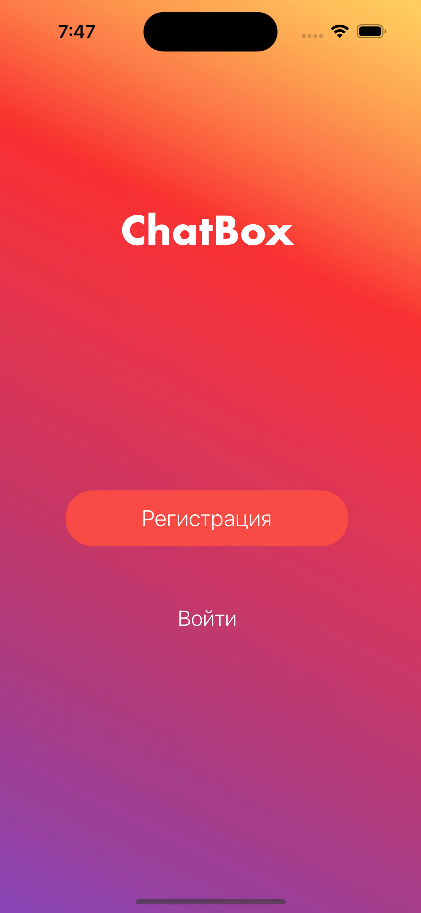
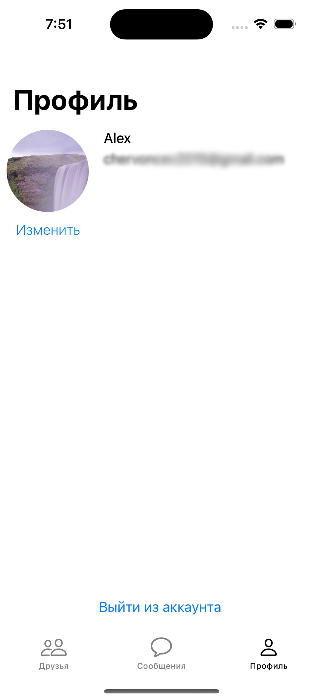
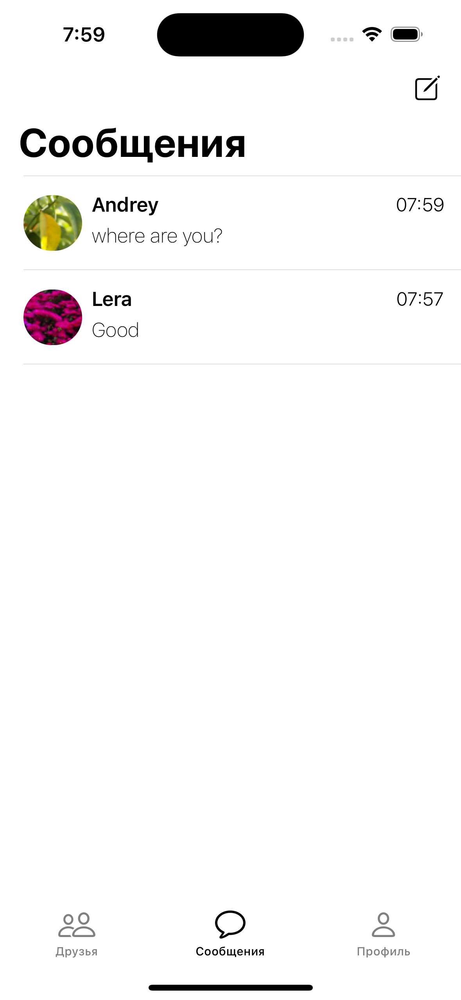

<h1>ChatBox Messenger</h1>

Welcome to the ChatBox Messenger project! This is a Swift-based messaging app that allows users to chat with each other in real-time. 

<h2>Screenshots</h2>

     

<h2>List of used libraries and frameworks</h2>

* UIKit

* Firebase

* SDWebImage

* MessageKit

* MBProgressHUD

<h2>Features</h2>

* User registration and authentication

* Real-time messaging

* Friend search

* adding a user photo
